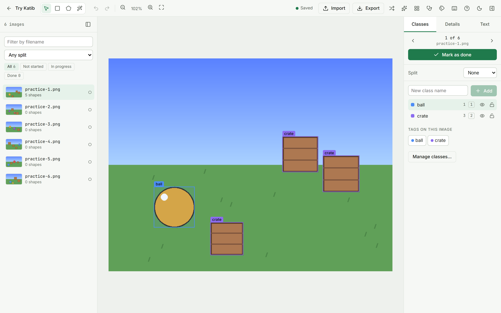
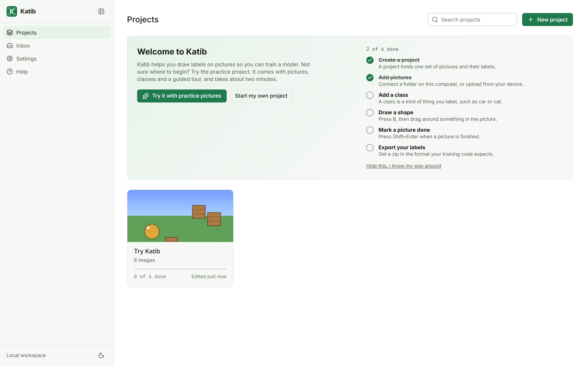
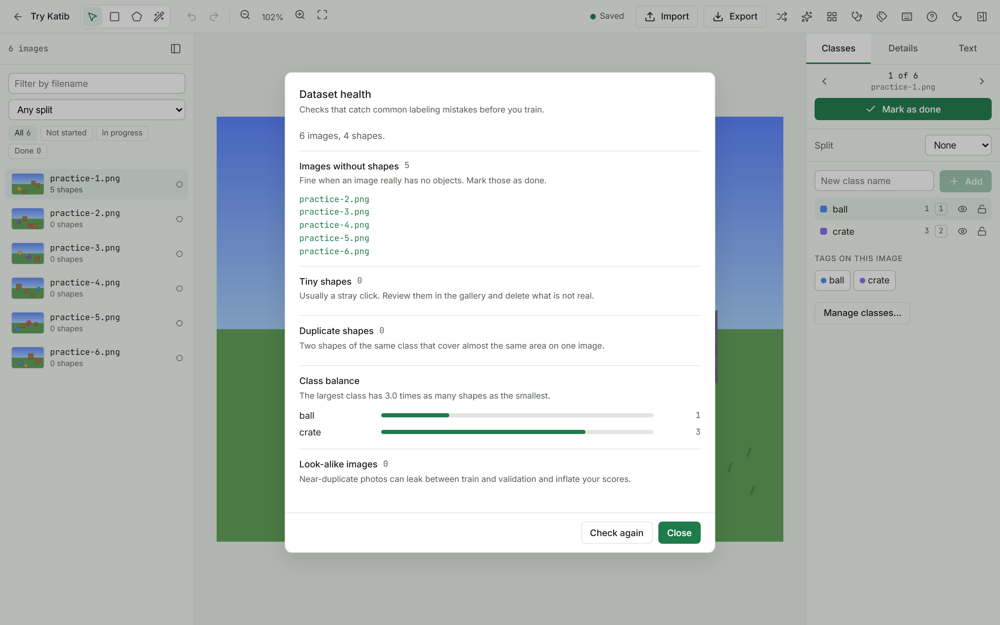
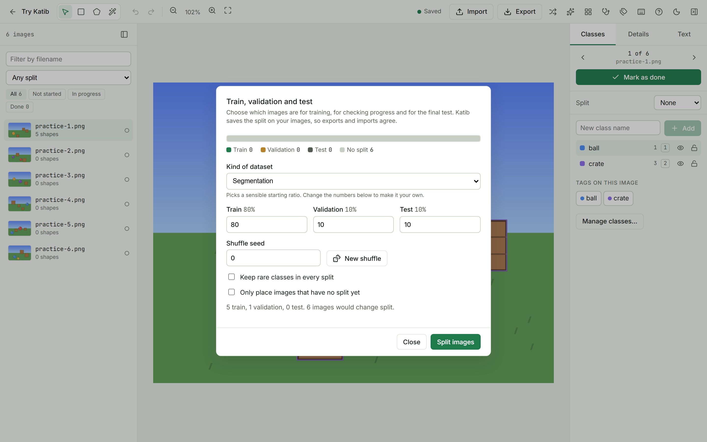
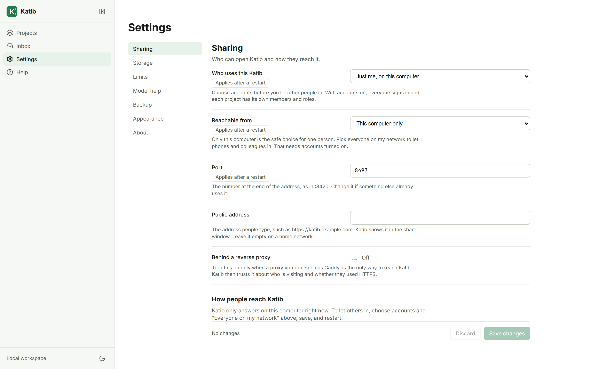
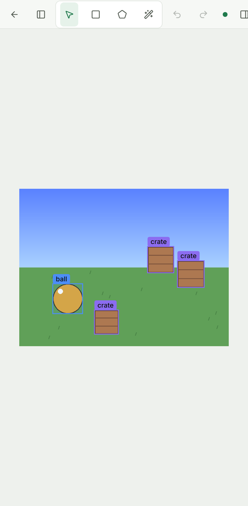

<p align="center">
  
</p>

<h1 align="center">Katib</h1>

<p align="center"><strong>Label images with your team, on your own machine.</strong></p>

<p align="center">
  <a href="https://github.com/MergenEnBilge/Katib/actions/workflows/ci.yml"></a>
  <a href="LICENSE"></a>
  
</p>

<p align="center">
  
</p>

Annotation tools tend to come in two shapes. Either a desktop app that is fine alone and falls
apart the moment a second person joins, or a hosted service that wants your images on someone
else's disk. Katib is neither. It starts with one command on your laptop, grows into a server your
whole team signs into, and your pictures never leave hardware you control.

It is a real tool for real datasets: thousands of images, several annotators, bulk fixes that would
take an afternoon by hand, and exports that drop straight into the training code you already have.

## Why you might like it

- **It is fast where it matters.** Number keys pick classes, arrows nudge shapes, `Shift+Enter`
  finishes a picture and opens the next. Every edit saves itself, so there is no save button and
  nothing to lose. A 3,000 image project opens a page of thumbnails in five milliseconds.
- **Mistakes are cheap.** Rename a class and every shape follows. Merge two classes or delete one
  with all its shapes, and Katib shows you exactly what it will touch before it does it. Changed
  your mind a fortnight later? Undo it from History.
- **It tells you what is wrong before you train.** Stray one-pixel shapes, duplicates, near-identical
  photos that will leak between train and validation, classes with a tenth of the examples of the
  rest.
- **Your data goes in and comes out.** YOLO, COCO, Pascal VOC, LabelMe and JSON Lines, in both
  directions, with train/validation/test splits preserved. Import the same file twice and nothing
  doubles.
- **Nothing phones home.** Katib makes no network requests of its own. No account, no telemetry, no
  usage tier.

## Install

| You want | Do this |
|----------|---------|
| Katib on your own computer | Download the installer for [Windows, macOS or Linux](https://github.com/MergenEnBilge/Katib/releases) and open it |
| Katib for your team | One line with Docker, below |
| Katib on your Android phone | `Katib-android.apk` from the same page |
| Katib on your iPhone | Open your server in Safari, then **Add to Home Screen** |
| To work on Katib itself | [From the source](docs/getting-started.md#from-the-source) |

Katib is still on release candidates, so the downloads are marked pre-release. With Docker, the
whole install is one line:

```bash
docker run -d --name katib --restart unless-stopped \
  -p 8420:8420 -v katib-data:/data \
  ghcr.io/mergenenbilge/katib:v0.1.0-rc1
```

Open <http://localhost:8420> and you are labelling. The [install
guide](docs/getting-started.md) walks through every platform properly, including
the warnings Windows and macOS show for software that is not code-signed yet.

New to this? On the home page, choose **Try it with practice pictures**. You get a small project
and a guided tour, and you will have drawn your first box inside two minutes.

<p align="center">
  
</p>

## What you can do with it

**Draw six kinds of shape.** Boxes, polygons, rotated boxes for things at an angle, keypoints with
skeletons, brush masks, whole-image tags, and text for captions or the words inside a shape. The
magic wand outlines an object from one click. Pick the kinds a project needs when you create it and
the toolbar only shows those.

**Catch problems before your model does.**

<p align="center">
  
</p>

**Split your data and keep it split.** Katib reads the train, validation and test folders your
dataset already has, remembers the split on each image, and uses it when you export. Reshuffle with
a seed you control, or set your own ratios.

<p align="center">
  
</p>

**Work together without stepping on each other.** Invite people with a link and give each a role:
owner, manager, annotator, reviewer or viewer. Katib hands each annotator the next image, shows who
else is on the project, and stops two people editing one image at once. Reviewers approve finished
images or send them back with a comment.

**Change anything without editing a file.** Every setting has a page, a plain explanation, and a
note saying whether it applies now or after a restart. Backups are one button.

<p align="center">
  
</p>

**Label from the sofa.** The interface adapts down to a phone. Add it to your home screen and it
keeps working when the signal drops; edits you make offline go up when you are back.

<p align="center">
  
</p>

## Using it with everything else

| | How |
|---|-----|
| Your training code | Export YOLO, COCO, VOC, LabelMe or JSON Lines, with or without the image files |
| Scripts and pipelines | A REST API and a [Python client](sdk/README.md). `pip install` it and drive Katib from a notebook |
| Your own model | Drop an ONNX detector in the models folder and let it draft boxes for you to correct |
| A phone or tablet | The Android app, or add the page to your home screen |
| Another machine on your network | `katib share` prints an address and a QR code |

## Documentation

| Guide | What is in it |
|-------|---------------|
| [Install and first project](docs/getting-started.md) | Every way to install, and your first labels |
| [Drawing and shortcuts](docs/drawing.md) | Each tool, every key |
| [Images, folders and formats](docs/data.md) | Importing, connecting folders, exports, splits |
| [Class tools and dataset health](docs/classes.md) | Renaming, merging, the gallery, the health checks |
| [Working together](docs/teams.md) | Accounts, invites, roles, review |
| [Put Katib online](docs/deploy.md) | Docker, HTTPS, Postgres, Raspberry Pi |
| [Running a server](docs/server.md) | Settings, backups, upgrades |
| [REST API and Python client](docs/automation.md) | Automating Katib |
| [How Katib is built](docs/internals.md) | The shape of the code, with diagrams |
| [Security](docs/security.md) | What Katib protects and what it leaves to you |

To read them as a website, run `uv run --group docs mkdocs serve`.

## Your logo

The logo in the app and on every icon comes from two files in [`brand/`](brand/README.md). Replace
`logo.svg` and `logo.png` with yours, run `python scripts/apply_brand.py`, and rebuild. The ones
there now are placeholders.

## Contributing

The backend is Python with FastAPI and SQLAlchemy. The front end is Svelte 5 and TypeScript, and the
drawing canvas is a small engine with no Svelte in it. [How Katib is built](docs/internals.md)
explains how the pieces fit together; [Contributing](docs/contributing.md) covers setup and the
checks.

```bash
uv sync --all-extras
pnpm --dir web install
uv run katib dev              # backend on :8420, reloads on change
pnpm --dir web dev            # front end on :5173, proxies /api to the backend
```

## Status

Katib is young. Everything described here works today, and the checks run on every push: the Python
tests against both SQLite and Postgres, the browser tests at desktop and phone sizes with an
automated accessibility pass, a Docker build, and speed budgets.

The Windows installer, the Linux `.deb` and the Android app have each been built and run. The macOS
disk image is built by the release workflow and has not been opened on a Mac. Installers are not
code-signed yet, so Windows and macOS will warn you the first time.

Not there yet: click-to-segment with a neural network (the magic wand covers simple cases), and
translations — the groundwork for other languages and right-to-left layouts is in place, but the
interface is English.

## License

MIT. See [LICENSE](LICENSE).
