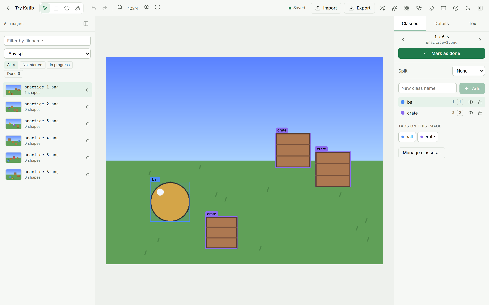
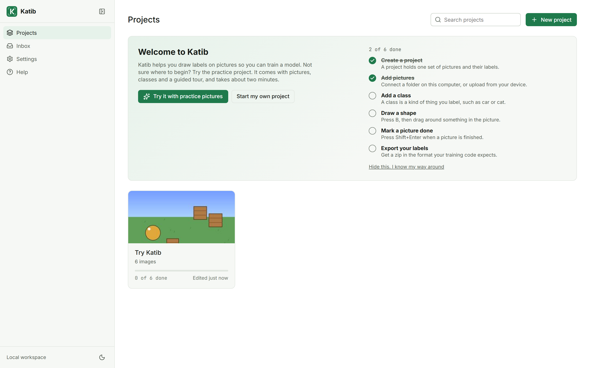
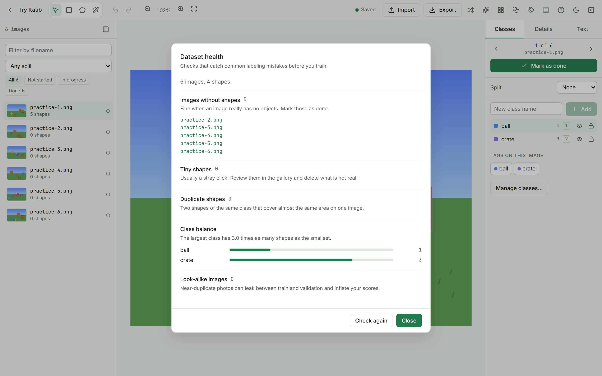
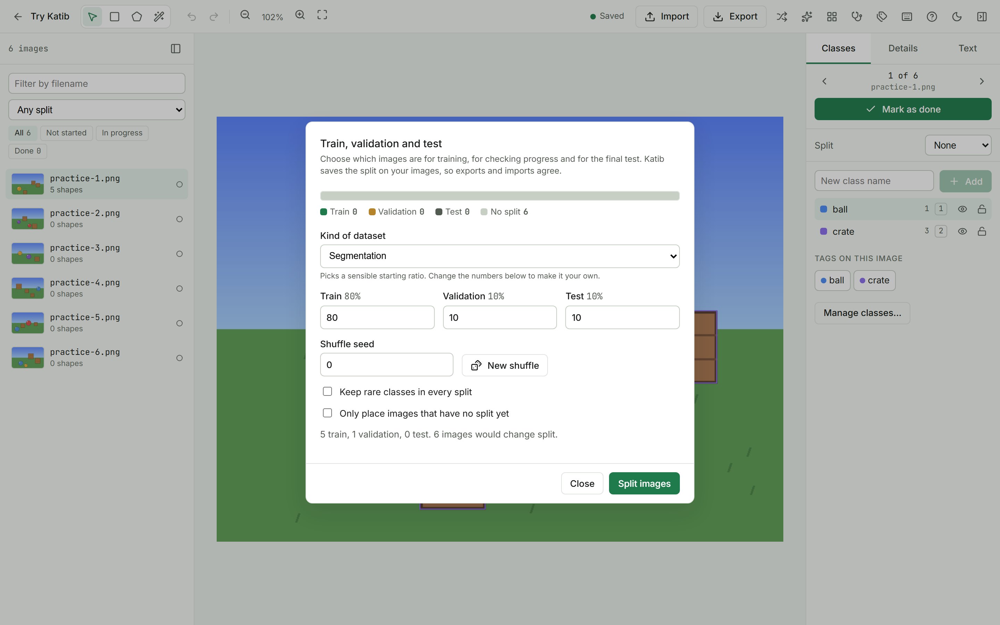
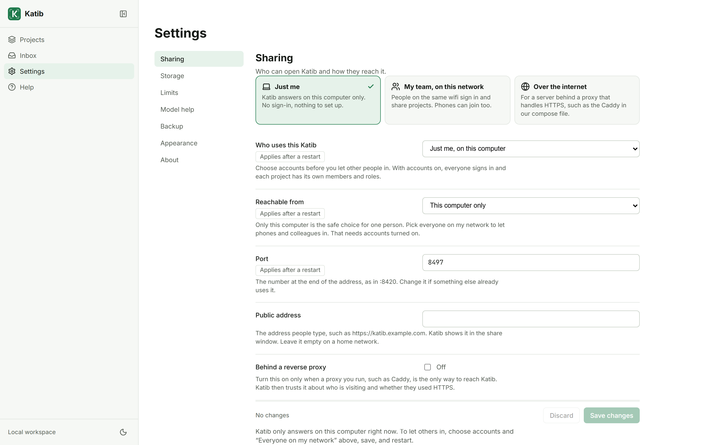
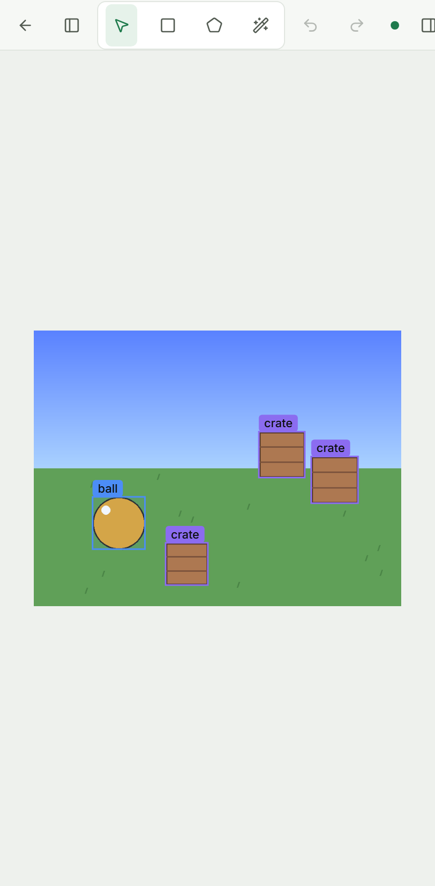

<p align="center">
  
</p>

<h1 align="center">Katib</h1>

<p align="center"><strong>Label images with your team, on your own machine.</strong></p>

<p align="center">
  <a href="https://github.com/MergenEnBilge/Katib/actions/workflows/ci.yml"></a>
  <a href="LICENSE"></a>
  
</p>

<p align="center">
  
</p>

Annotation tools tend to come in two shapes. Either a desktop app that is fine alone and falls
apart the moment a second person joins, or a hosted service that wants your images on someone
else's disk. Katib is neither. It starts with one command on your laptop, grows into a server your
whole team signs into, and your pictures never leave hardware you control.

It is a real tool for real datasets: thousands of images, several annotators, bulk fixes that would
take an afternoon by hand, and exports that drop straight into the training code you already have.

## Why you might like it

Annotation is repetitive work, so the keyboard matters more than anything. Number keys pick classes,
arrows nudge shapes a pixel at a time, `Shift+Enter` marks a picture done and opens the next one.
There is no save button, because every edit saves itself. On a project of 3,000 images a page of
thumbnails comes back in five milliseconds, and it stays that way at 30,000.

Mistakes are cheap to fix. Rename a class and every shape follows. Merge two classes, or delete one
with all its shapes, and Katib shows you what it is about to touch before it touches anything. If
you realise a fortnight later that it was the wrong call, undo it from History — that log is kept
for 30 days and survives closing the browser.

It also tells you what is wrong with a dataset before you waste a training run on it: stray
one-pixel shapes from an accidental click, duplicate boxes, near-identical photos that will leak
between your train and validation sets, classes with a tenth of the examples of the rest.

Your data goes in and comes back out. YOLO, COCO, Pascal VOC, LabelMe and JSON Lines, both
directions, with train/validation/test splits preserved. Import the same annotation file twice and
nothing doubles.

And it is quiet. No account to create, no telemetry, no licence check, nothing to switch off. The
only thing Katib ever fetches from the internet on its own is a model you asked it to download by
name under Settings, and even that is optional — bring your own file instead and it never reaches
the network at all.

## Install

| You want | Do this |
|----------|---------|
| Katib on your own computer | Download the installer for [Windows, macOS or Linux](https://github.com/MergenEnBilge/Katib/releases) and open it |
| Katib for your team | One line with Docker, below |
| Katib on your Android phone | `Katib-android.apk` from the same page |
| Katib on your iPhone | Open your server in Safari, then **Add to Home Screen** |
| To work on Katib itself | [From the source](docs/getting-started.md#from-the-source) |

With Docker, the whole install is one line:

```bash
docker run -d --name katib --restart unless-stopped -p 8420:8420 -v katib-data:/data ghcr.io/mergenenbilge/katib:v0.4.0
```

Open <http://localhost:8420>. Katib asks for a setup code before it will make the first account,
since whoever makes it runs the server — `docker exec katib cat /data/setup-code.txt` shows it.
Then you are labelling. The [install guide](docs/getting-started.md) walks through every platform
properly, including the warnings Windows and macOS show for software that is not code-signed yet.

New to this? On the home page, choose **Try it with practice pictures**. You get a small project
and a guided tour, and you will have drawn your first box inside two minutes.

<p align="center">
  
</p>

## What you can do with it

There are six kinds of shape: boxes, polygons, rotated boxes for anything sitting at an angle,
keypoints with skeletons, brush masks, and whole-image tags. Text sits alongside them, for captions
or for transcribing the words inside a shape. You choose which kinds a project uses when you create
it, and the toolbar shows only those.

Two of the tools draw for you. The magic wand outlines an object that stands out from its
background, with no model and no setup. Give Katib a Segment Anything model and the click-to-select
tool outlines things the wand cannot follow — a dog on a lawn, a car among cars — and shift-clicking
adds what it missed. Both run on your own hardware.

Before you commit to a training run, the health panel looks for the things that quietly ruin one.

<p align="center">
  
</p>

Splits are treated as part of the data rather than an export-time afterthought. Katib reads the
train, validation and test folders a dataset arrives with, keeps the split on each image, and uses
it when you export. Reshuffle with a seed you control, or set your own ratios per dataset kind.

<p align="center">
  
</p>

For teams, invite people with a link and give each one a role — owner, manager, annotator, reviewer
or viewer. Invite someone who will work on a phone and you get a code to hold a camera up to, which
downloads the app if they need it and opens the project if they already have it. Or skip invites
and create the accounts yourself, passwords and all, from Settings. Katib hands each annotator the
next image, shows who else is on the project, and stops two people editing the same image at once.
Reviewers approve finished images or send them back with a comment.

You should never need to edit a config file. Sharing opens with three choices — just you, your team
on this network, over the internet — and picking one sets everything that goes with it. Every other
setting has an explanation in plain words and a note saying whether it takes effect now or after a
restart. Backups are a button.

<p align="center">
  
</p>

The interface goes all the way down to a phone. Click the workspace name on a computer and Katib
shows two codes: one your phone camera downloads the Android app from, and one the app scans to
connect — so nobody types an IP address on a phone keyboard. Add it to your home screen instead and
it keeps working when the signal drops; anything you drew offline is sent the next time you have a
connection.

<p align="center">
  
</p>

## Using it with everything else

| | How |
|---|-----|
| Your training code | Export YOLO, COCO, VOC, LabelMe or JSON Lines, with or without the image files |
| Scripts and pipelines | A REST API and a [Python client](sdk/README.md). `pip install` it and drive Katib from a notebook |
| Your own model | An ONNX detector drafts boxes for you to correct; a SAM model outlines what you click |
| A phone or tablet | The Android app, or add the page to your home screen |
| Another machine on your network | `katib share` prints an address and a QR code |

## Documentation

| Guide | What is in it |
|-------|---------------|
| [Install and first project](docs/getting-started.md) | Every way to install, and your first labels |
| [Drawing and shortcuts](docs/drawing.md) | Each tool, every key |
| [Images, folders and formats](docs/data.md) | Importing, connecting folders, exports, splits |
| [Class tools and dataset health](docs/classes.md) | Renaming, merging, the gallery, the health checks |
| [Working together](docs/teams.md) | Accounts, invites, roles, review |
| [Put Katib online](docs/deploy.md) | Docker, HTTPS, Postgres, Raspberry Pi |
| [Running a server](docs/server.md) | Settings, backups, upgrades |
| [REST API and Python client](docs/automation.md) | Automating Katib |
| [How Katib is built](docs/internals.md) | The shape of the code, with diagrams |
| [Security](docs/security.md) | What Katib protects and what it leaves to you |

To read them as a website, run `uv run --group docs mkdocs serve`.

## Contributing

The backend is Python with FastAPI and SQLAlchemy. The front end is Svelte 5 and TypeScript, and the
drawing canvas is a small engine with no Svelte in it. [How Katib is built](docs/internals.md)
explains how the pieces fit together; [Contributing](docs/contributing.md) covers setup and the
checks.

```bash
uv sync --all-extras
pnpm --dir web install
uv run katib dev              # backend on :8420, reloads on change
pnpm --dir web dev            # front end on :5173, proxies /api to the backend
```

## Status

This is 0.4.0. Everything described here works today, and the checks run on every push: the
Python tests against both SQLite and Postgres, the browser tests at desktop and phone sizes with
an automated accessibility pass, a Docker build, and speed budgets. Every export format is
exercised by a test that sends a project out through the API and reads it back in again.

Since 0.3.1: on a desktop, the server is its own program with an icon in the system tray, and the
window is just one more client of it, so closing the window no longer cuts off every phone and
colleague connected to it. Owners and managers can add people who already have an account to a
project, straight from its card. An invite link works for someone who already has an account, and
nobody is shown buttons their role cannot use.

Since 0.3.0: the desktop app can now connect to a Katib someone else is already running, instead
of only ever starting one of its own, and the address its own Share window hands out is the one
it is actually listening on — sharing had been fixed to bind the right network address, but not
the right port, so the address it handed out reached nothing. A handful of security fixes are
listed in [Security](docs/security.md).

Since 0.2.0: the desktop app's own window can share on your network at all — turning that on used
to be accepted and saved but silently ignored. Click to select can fetch a Segment Anything model
by name instead of asking you to bring your own file, and a project can be deleted, or its team
managed, straight from its card in the project list. The guided tour, which used to lose track of
what it was pointing at on a phone, opens whatever panel it needs to point at instead.

Being honest about what that number does and does not promise:

- The Windows installer, the Linux `.deb`, the Docker image and the Android app have each been
  built and run. The macOS disk image is built by the release workflow and has not been opened on
  a Mac.
- The background server was run frozen on Windows: started the way Explorer starts it, found by
  a second client, stopped from the command line and by the uninstaller's stop, with no process
  left behind each time. Its tray menu and the Linux tray have not been clicked through by hand
  in this release.
- Installers are not code-signed, so Windows and macOS warn you the first time. The APK is signed
  with a debug key unless you configure a release keystore.
- Click to select has been run end to end against a real downloaded Segment Anything model, not
  only the stand-in used in tests — that is also how a real failure mode of the smallest model
  turned up and got a guard against it, rather than something found later by someone relying on it.
- The Android app is a WebView around the same interface as the browser, not a native app. Making
  it one is a larger piece of work than fits in one release.
- Your data is safe to keep: every schema change ships with a migration, and upgrading a container
  runs them at startup.

Not there yet: translations. The groundwork for other languages and right-to-left layouts is in
place, but the interface is English.

[Security](docs/security.md) lists what Katib protects, what it leaves to you, and what the
reviews before this release found.

## License

MIT. See [LICENSE](LICENSE).
