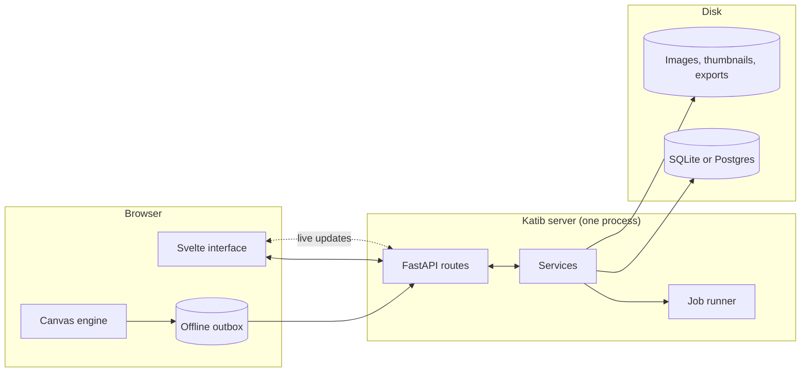
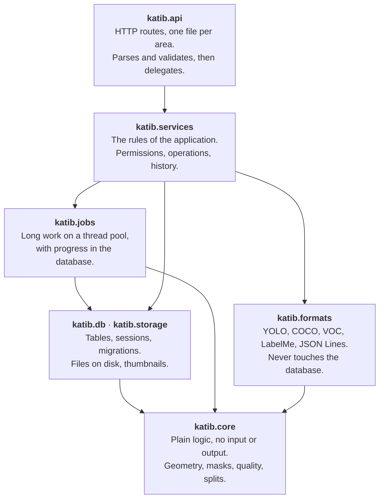
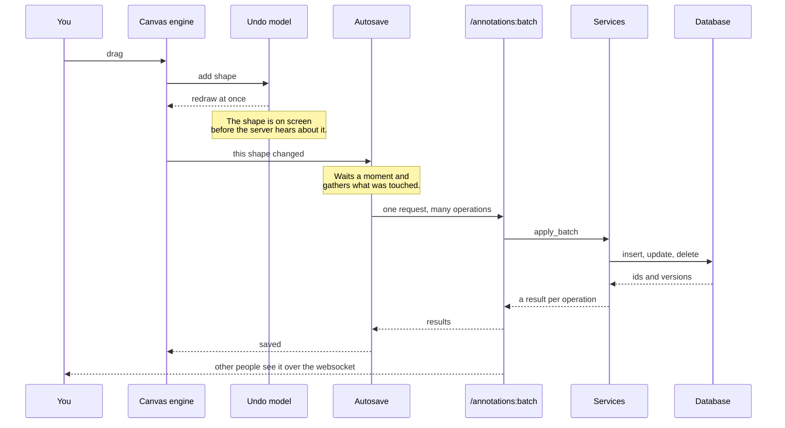
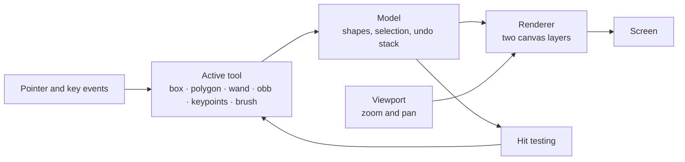

# How Katib is built

A map of the code, for anyone who wants to change it. [Contributing](contributing.md) covers setup
and the checks; this page covers the shape of things.

## The short version

Katib is one Python process that serves both an API and the built front end, and one browser
application that talks to it. There is no separate worker, no message broker and no cache to run.
A single-person install is that process and a SQLite file. A team install is the same process, with
Postgres behind it and a reverse proxy in front.

## Layers on the server

The Python code is in layers, and the rule is one-directional: a layer may use the ones below it and
never the ones above. This is not a convention anyone has to remember — `uv run lint-imports`
enforces it on every push, and the build fails if a layer reaches upward.

Two more rules hold, also enforced:

- `katib.core` imports nothing from the rest of Katib. It is pure functions over plain data, which
  is why it is the part with property-based tests.
- `katib.formats` never touches the database. A reader turns a file into plain records; a writer
  turns plain records into a file. That is what makes adding a format small.

`katib.core` and `katib.services` are additionally type-checked in pyright's strict mode.

## What happens when you draw a box

Worth following once, because almost every edit takes this path.

Three things follow from this shape:

- **The interface never waits for the server.** The canvas draws from its own model. The save is a
  consequence, not a step.
- **Edits are batched.** Autosave remembers which shapes were touched, then sends the current state
  of each one. Dragging a corner thirty times is one operation, not thirty.
- **A lost connection is not a lost edit.** Unsent operations go to an outbox in the browser and are
  sent when Katib next opens with a connection.

## The canvas

The drawing engine lives in `web/src/lib/canvas` and has no dependency on Svelte. It is given a
host element and a model, and it draws. That separation is why the shape logic can be unit-tested
without a browser, and why the tools are small.

A tool only has to answer "what does a press, a move and a release mean". Everything else — what is
selected, what undo does, how it is painted, which shape is under the cursor — is shared.

## Where things live

| Folder | What is in it |
|--------|---------------|
| `src/katib/core` | Geometry, run-length masks, detection decoding, quality checks, split maths |
| `src/katib/formats` | One module per dataset format, plus the registry |
| `src/katib/services` | Projects, images, annotations, classes, access, tasks, splits, settings, backups |
| `src/katib/api` | HTTP routes, one file per area, plus security headers and dependencies |
| `src/katib/db` | Models, sessions, Alembic migrations |
| `src/katib/storage` | Files on disk, thumbnails, safe path handling |
| `src/katib/jobs` | The thread pool that runs imports and exports |
| `src/katib/ml` | The optional ONNX runtime for pre-labelling |
| `web/src/lib/canvas` | The drawing engine, with no Svelte in it |
| `web/src/lib/sync` | Autosave, the offline outbox, the websocket |
| `web/src/routes` | Screens and dialogs |
| `sdk` | The Python client, published separately |
| `installers` | Everything that turns Katib into something you can install |

## Things that are deliberate

- **Original images are never modified.** A connected folder is read where it sits. Uploads are
  copied into the data folder once and then only read. Nothing writes back over a photo.
- **Destructive operations are previewed, recorded and reversible.** Merging or deleting a class
  shows what it will touch, writes an `operations` row, and can be undone for 30 days.
- **Undo survives a reload** because it lives in that table, not in browser memory.
- **Jobs are rows, not threads.** Progress is written to the database, so a page refresh does not
  lose track of an import, and a job left running by a crash is marked failed on the next start.
- **No copyleft dependencies.** Katib is MIT and stays installable inside a company.

## Adding things

- **A dataset format** is a class with `id`, `label`, `supports`, `detect`, `read` and `write`
  (see `katib/core/dataset.py`). Add it to the list in `katib/formats/__init__.py`, or publish it
  as a plugin with the `katib.formats` entry point. Add golden files and a round-trip test.
- **A drawing tool** implements the tool interface in `web/src/lib/canvas/tools/tool.ts` and is
  registered in the engine. The model and renderer need no changes.
- **A setting** is one entry in `katib/services/app_settings.py`. The page, the validation and the
  restart badge follow from it.
- **A language** is a copy of `web/src/lib/i18n/en.ts` with an entry in `LOCALES`. See
  [Contributing](contributing.md#adding-a-language).
